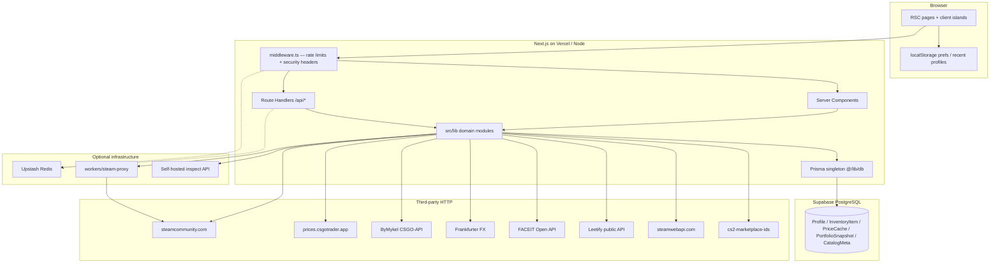
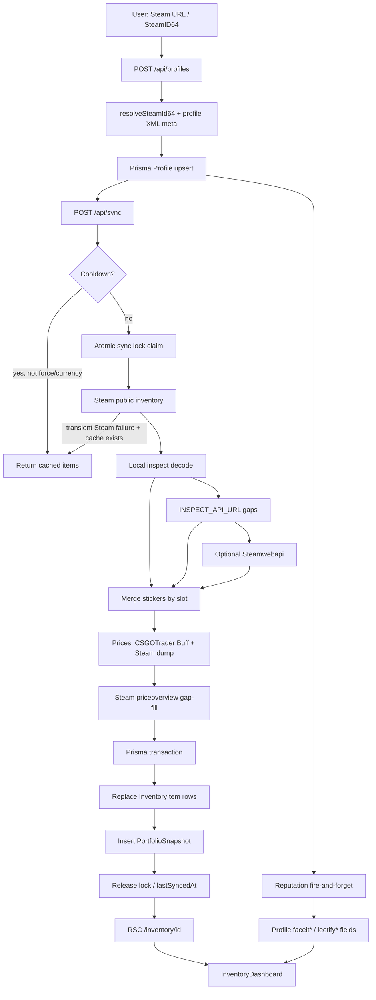
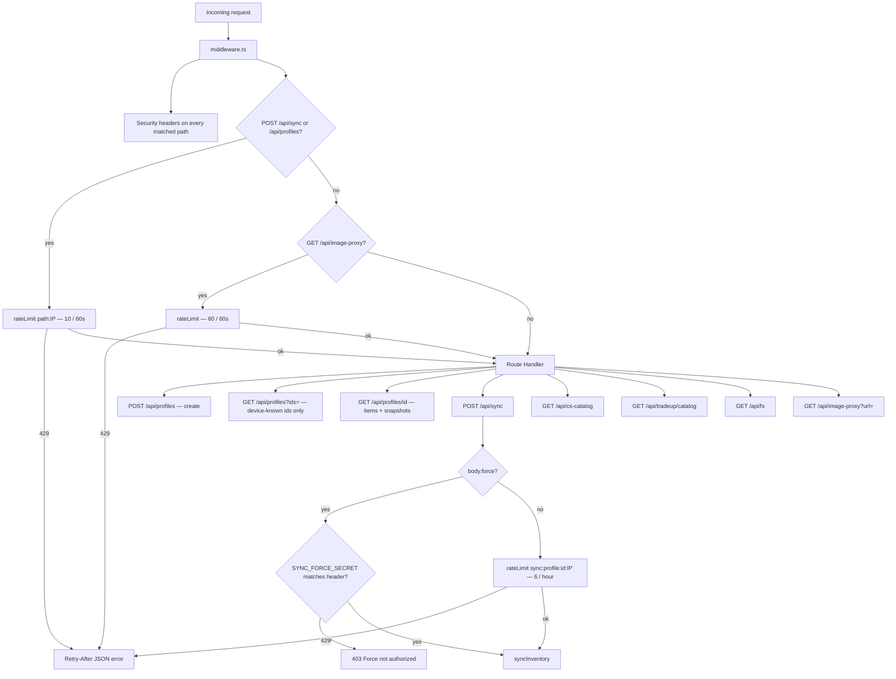
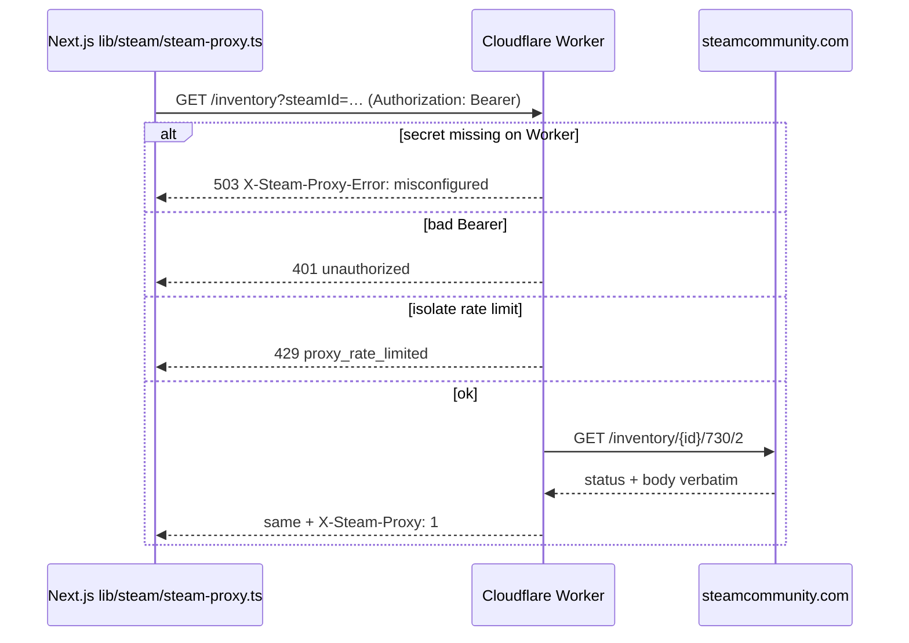
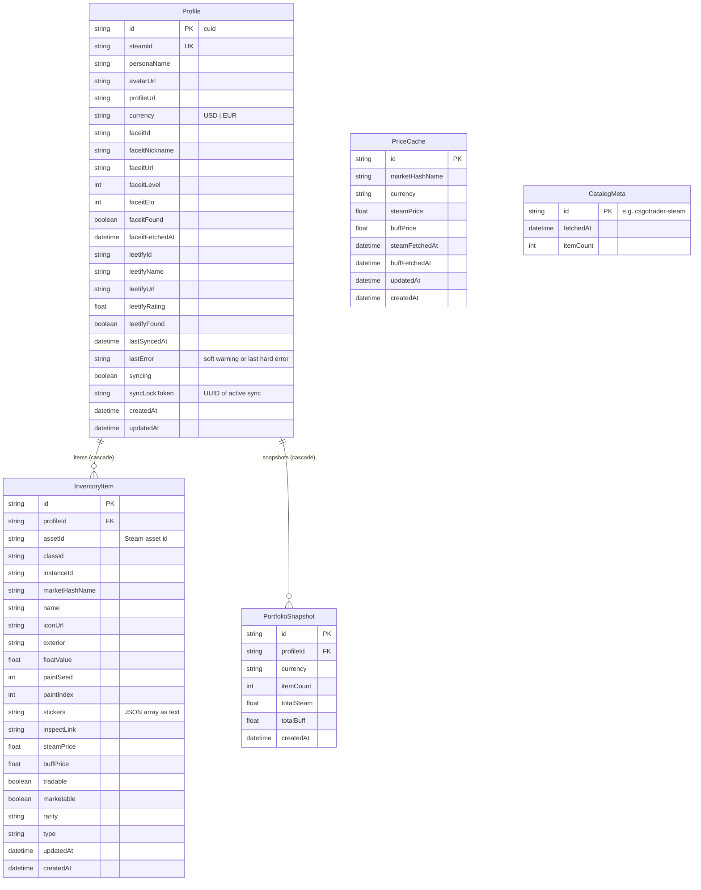

# Architecture

SkinStation is a **local-first, login-free** CS2 inventory tracker. A visitor pastes a public Steam profile; the server resolves SteamID64, syncs the CS2 backpack, enriches floats / stickers / prices, stores everything in **PostgreSQL**, and renders portfolio UI in Next.js.

This document is the source of truth for how the system is structured, why those choices were made, and how data moves. For setup and env vars, see [`README.md`](README.md). For production cutover, see [`docs/DEPLOY.md`](docs/DEPLOY.md).

---

## 1. Goals and constraints

| Goal | Implication |
| --- | --- |
| No Steam login | Only **public** Community inventory JSON; private inventories fail with HTTP 403 |
| Core sync must work without paid APIs | Inspect, Steamwebapi, FACEIT, and Leetify are optional enrichers |
| Missing prices never crash a sync | UI uses `—` / unpriced; helpers `itemPrice` / `portfolioTotalFromItems` share the same fallback |
| Serverless-friendly | Prisma singleton, Upstash REST rate limits, `maxDuration = 300` on `/api/sync` |
| Vercel egress is hostile to Steam | Optional Cloudflare Worker proxy; when configured, **never** fall back to direct Steam |
| Share cards must export PNGs | Allowlisted `/api/image-proxy` so `html-to-image` can taint-free canvas-draw Steam CDN images |

**Non-goals:** user accounts, Steam trade execution, marketplace checkout, historical market backfill, private inventory access.

---

## 2. System context



Prisma is imported **only** from `@/lib/db`. Never instantiate `PrismaClient` in routes or Server Components (scripts that need a one-shot client, such as `smoke-db` / `db:harden`, are the exception).

---

## 3. Tech stack decisions

### 3.1 Next.js 15 App Router + React 19

- **React Server Components by default.** `'use client'` is reserved for state, browser APIs, Recharts, and `html-to-image`.
- Inventory and catalog pages load Prisma on the server, parse stickers JSON, then pass serializable props to client dashboards.
- Next.js 15: `params` and `searchParams` (and Route Handler `params`) are **Promises** — always `await` them.
- `/api/sync` sets `export const maxDuration = 300` because a large inventory + inspect + price gap-fill can exceed the default serverless timeout.

### 3.2 Tailwind CSS 4, not v3 config

Global CSS uses `@import "tailwindcss"` and `@theme` (`src/app/globals.css`). Page themes (Executive Terminal and siblings) are CSS variables applied from client theme state — hydrate defaults first, then read `localStorage` in `useEffect`.

### 3.3 Typography

| Face | CSS variable | Role |
| --- | --- | --- |
| Inter | `--font-ui` | Body UI |
| JetBrains Mono | `--font-data` | Prices, floats, SteamIDs |
| Fraunces | `--font-share-display` | Share-card display headings |
| Outfit | `--font-share-body` | Share-card body |

Loaded in `src/app/layout.tsx` via `next/font/google`.

### 3.4 Prisma 6 + PostgreSQL (Supabase)

SQLite was archived under `prisma/migrations_sqlite_archive/`. Production uses:

- `DATABASE_URL` — **transaction pooler** (port `6543`, `?pgbouncer=true`) for the app. Prepared statements and long transactions are avoided; Prisma uses this URL at runtime.
- `DIRECT_URL` — **direct / session** (port `5432`) for `prisma migrate deploy` and `migrate dev`.

Supabase JS (`@supabase/ssr`, `@supabase/supabase-js`) is **not** on the request path. RLS / Data API hardening is a defense-in-depth step (`npm run db:harden`) so `anon` cannot read Prisma tables through PostgREST.

### 3.5 Inspect libraries over a required GC bot

Valve no longer exposes certificate floats on typical public inventory JSON (`%propid:N%` placeholders). Local libraries decode **masked / hybrid** inspect links when Steam happens to return them. A self-hosted CSGOFloat-compatible bot (`INSPECT_API_URL`) is the reliable path for classic `S…A…D` links. Steamwebapi is last-resort and quota-sensitive.

### 3.6 CSGOTrader dumps over scraping Buff/Steam for every item

CSGOTrader publishes bulk Buff163 + Steam price JSON. SkinStation caches those dumps (~6h TTL, `CatalogMeta` bookkeeping) and only calls Steam `priceoverview` for names missing from the dump (capped per sync). EUR is derived from USD via Frankfurter when the dump is USD-denominated.

### 3.7 Upstash over a process-local Map on Vercel

`src/lib/api/rate-limit.ts` uses `@upstash/ratelimit` sliding windows when REST credentials exist. Otherwise it uses an in-memory token bucket (max 5 000 keys). On serverless, in-memory limits are **per instance** and weaker — production should set Upstash.

### 3.8 Cloudflare Worker Steam proxy

Steam aggressively rate-limits Vercel’s shared NAT. The Worker is a **server-to-server** proxy (Bearer secret, no public CORS). When `STEAM_PROXY_URL` **and** `STEAM_PROXY_SECRET` are set, inventory / vanity XML / profile XML / `priceoverview` go through the Worker and **must not** silently fall back to direct Steam (that would reintroduce Vercel egress and hide misconfiguration).

---

## 4. Directory structure

```
skinstation/
├── .cursor/rules/                 # Agent coding rules (cs2-inventory-tracker)
├── docs/DEPLOY.md
├── prisma/
│   ├── schema.prisma
│   ├── migrations/                # PostgreSQL
│   └── migrations_sqlite_archive/
├── public/faceit/                 # FACEIT level icons (level-1.png … 10)
├── scripts/                       # smoke-db, db:harden, inspect probes
├── src/
│   ├── app/                       # Routes (RSC pages + API handlers)
│   ├── components/                # Client UI ("use client")
│   ├── lib/                       # Server/shared domain logic
│   └── middleware.ts              # Rate limits + security headers
├── workers/steam-proxy/           # Cloudflare Worker
├── .env.example
├── next.config.ts                 # Steam CDN remotePatterns
├── vercel.json                    # buildCommand: npm run build:vercel
└── package.json
```

### 4.1 `src/app` — pages

| Path | File | Role |
| --- | --- | --- |
| `/` | `app/page.tsx` | Home hub + catalog showcase (`force-dynamic`) |
| `/inventory` | `app/inventory/page.tsx` | Lookup landing |
| `/inventory/[id]` | `app/inventory/[id]/page.tsx` | Inventory dashboard (Prisma → client) |
| `/share/[id]` | `app/share/[id]/page.tsx` | Wrapped card (`?source=buff\|steam&theme=`) |
| `/database` | `app/database/page.tsx` | Skin catalog browser |
| `/database/[id]` | `app/database/[id]/page.tsx` | Item detail |
| `/collections/[id]` | `app/collections/[id]/page.tsx` | Collection detail |
| `/tradeup` | `app/tradeup/page.tsx` | Trade-up calculator |
| `/status` | `app/status/page.tsx` | Early Access limitations |
| `/privacy`, `/terms` | legal pages | Hosted-Postgres language |
| `/sitemap.xml` | `app/sitemap.ts` | Static routes + catalog/collection URLs |
| `/robots.txt` | `app/robots.ts` | Allow `/`, disallow `/api/` |

### 4.2 `src/app/api` — Route Handlers

Documented in [§6](#6-authentication-and-api-routes).

### 4.3 `src/lib` — domain modules

| Module | Responsibility |
| --- | --- |
| `lib/db.ts` | Prisma singleton |
| `lib/sync/inventory-sync.ts` | Profile upsert + full sync orchestrator + lock |
| `lib/steam/resolve.ts` | SteamID64 / vanity / URL → profile meta |
| `lib/steam/inventory.ts` | Public Steam CS2 inventory fetch + HTML sticker parse |
| `lib/steam/steam-proxy.ts` | Optional CF Worker vs direct Steam HTTP |
| `lib/csfloat/inspect.ts` | Local inspect-link float / sticker decode |
| `lib/inspect/links.ts` | Masked / hybrid / `%propid` / classic S/A/D classification |
| `lib/inspect/remote.ts` | Optional `INSPECT_API_URL` enricher |
| `lib/steamwebapi/*` | Optional inventory + float enrichment |
| `lib/stickers/*` | Parse, merge by slot, normalize names, icon catalog |
| `lib/steam-market/*` | CSGOTrader Buff163 + Steam prices + `priceoverview` gap-fill |
| `lib/buff/goods-ids.ts` | Buff163 numeric goods ids for market links |
| `lib/cs-catalog/*` | ByMykel catalog, wears, phases, nav |
| `lib/tradeup/*` | Eligibility, odds, EV, catalog payload |
| `lib/reputation/lookup.ts` | FACEIT + Leetify |
| `lib/api/rate-limit.ts` | Upstash / in-memory limiter |
| `lib/api/errors.ts` | Sanitized client errors + force-sync auth |
| `lib/currency.ts` / `lib/price-source.ts` | Currency / price-source prefs + totals |
| `lib/share-card*.ts` | Share card stats, theme, PNG helpers, image allowlist |
| `lib/fx.ts` | USD→EUR (Frankfurter, 24h in-process cache) |
| `lib/site.ts` | Canonical URL, metadata, User-Agent `SkinStation/1.0` |

Path alias: `@/*` → `./src/*` (`tsconfig.json`). Relative `../../lib/...` imports are forbidden by project rules.

---

## 5. End-to-end data flow



### 5.1 Profile creation

1. Home / inventory form → `POST /api/profiles` with `{ input }`.
2. `ensureProfileFromInput()` (`lib/sync/inventory-sync.ts`):
   - Resolve SteamID64 (`lib/steam/resolve.ts`) via vanity XML or raw 17-digit id.
   - Fetch persona/avatar (`fetchSteamProfileMeta` — profile XML).
   - `prisma.profile.upsert` on unique `steamId`.
   - Kick off `applyReputationToProfile` **without blocking**.
3. Client stores the opaque `profile.id` in `skinstation-recent-profiles` (max 8) and calls `POST /api/sync`.

### 5.2 Inventory sync (`syncInventory`)

1. **Cooldown.** If `lastSyncedAt` is within `SYNC_COOLDOWN_MS` and this is not an authorized force or currency change, return cached items (`skippedCooldown: true`). Reputation still refreshes if never fetched.
2. **Lock.** Atomic `updateMany` where `syncing: false` **or** `syncing: true` and `updatedAt` older than **10 minutes**. Sets `syncLockToken` (UUID). Concurrent claim → thrown error → HTTP 409. Force does **not** steal a fresh lock.
3. **Inventory.** `fetchSteamInventory(steamId)` — Steam Community JSON via optional `STEAM_PROXY_*`. Pages of 2000, 1.5s between pages, max 20 pages (~40 000 items). In-process cache 15 minutes unless `force`.
4. **Soft-fail.** Private/hidden → hard fail. Transient Steam / proxy network / 429 **and** existing rows → release lock with warning, serve DB cache (`usedCachedInventory: true`). Proxy **auth/config** errors hard-fail (ops must fix the secret).
5. **Floats / patterns** — see [§8](#8-float-and-sticker-cascade).
6. **Stickers.** `mergeStickersBySlot(descriptions, local, inspect API, certificate, webapi)` → icons from inventory sticker items + ByMykel sticker catalog; prices looked up as `Sticker | Name`.
7. **Prices** — see [§9](#9-pricing-cascade).
8. **Persist** in one `prisma.$transaction`:
   - `deleteMany` + `createMany` `InventoryItem` for the profile (full replace).
   - `PortfolioSnapshot` with `totalSteam` / `totalBuff` from `portfolioTotalFromItems` (same fallback as the grid).
   - `updateMany` where `syncLockToken` still matches: `lastSyncedAt`, `syncing: false`, optional soft `lastError`.

**Stickers in DB:** `InventoryItem.stickers` is a **JSON string**. Always parse with `parseStickersJson()` at read boundaries (pages / API). Never assume a JSON column.

### 5.3 Reputation (FACEIT / Leetify)

| Source | Auth | Role |
| --- | --- | --- |
| Leetify public API | None | Rating + FACEIT rank fallback |
| FACEIT Open API | Optional `FACEIT_API_KEY` | Official level / ELO / nickname |
| FaceitFinder | Link only | Profile URL when official URL unavailable |

Triggered on profile create, during sync (parallel), and on inventory page load if `faceitFetchedAt` is null. Cached ~24h unless forced. Failures **never** block inventory sync.

---

## 6. Authentication and API routes

SkinStation has **no end-user authentication**. “Auth” in this system means:

1. **Public, unauthenticated** app APIs (rate-limited by IP).
2. **Admin force-sync** via shared secret header.
3. **Server-to-server** Bearer auth to the Steam proxy and optional inspect/FACEIT/Steamwebapi keys.



### 6.1 Public HTTP API

| Method | Path | Auth | Notes |
| --- | --- | --- | --- |
| `POST` | `/api/profiles` | None + IP rate limit | Body `{ input }`. Resolves Steam, upserts Profile |
| `GET` | `/api/profiles?ids=` | None | Comma-separated ids, max 8. Empty `ids` → `{ profiles: [] }` — **not** a global recent list |
| `GET` | `/api/profiles/[id]` | None | Profile + items (stickers parsed) + last 100 snapshots + Buff goods ids |
| `POST` | `/api/sync` | None + IP + per-profile limits; optional force secret | Body `{ profileId?, input?, force?, currency? }`. `maxDuration` 300s |
| `GET` | `/api/cs-catalog` | None | Slim catalog + collections; Steam USD prices attached when available |
| `GET` | `/api/tradeup/catalog?currency=` | None | Skins, collections, crates, prices, goods ids |
| `GET` | `/api/fx` | None | `{ usdToEur, eurToUsd }` |
| `GET` | `/api/image-proxy?url=` | None + IP rate limit | HTTPS Steam CDN allowlist only |

All JSON error bodies are `{ error: string }` with an appropriate status (`src/lib/api/errors.ts`).

### 6.2 Force-sync authorization

```ts
// src/lib/api/errors.ts — isForceSyncAuthorized
```

- `force: true` in the body is ignored unless `SYNC_FORCE_SECRET` is set **and** equals `x-sync-force-secret` or `Authorization: Bearer …`.
- Mismatch → HTTP 403. Unset secret → force always false (public UI cannot escalate).

### 6.3 Steam proxy (separate origin)



Worker routes (`workers/steam-proxy/src/index.ts`):

| Path | Auth | Steam target |
| --- | --- | --- |
| `GET /health` | No | Smoke only |
| `GET /inventory` | Bearer | `/inventory/{steamId}/730/2` |
| `GET /vanity` | Bearer | `/id/{vanity}/?xml=1` |
| `GET /profile` | Bearer | `/profiles/{steamId}/?xml=1` |
| `GET /priceoverview` | Bearer | `/market/priceoverview/` (appid 730 only) |

Not a browser CORS proxy. OPTIONS is rejected. Input is validated (SteamID64 regex, vanity charset, `count` 1–2000).

### 6.4 Pages that read the database without going through `/api`

`/inventory/[id]`, `/share/[id]`, and home showcase use Prisma in Server Components. They are publicly reachable by opaque id (same trust model as the JSON API).

---

## 7. Database schema

Prisma schema: `prisma/schema.prisma`. Provider `postgresql` with `url = env("DATABASE_URL")` and `directUrl = env("DIRECT_URL")`.



### 7.1 Indexes and uniqueness

| Model | Constraints |
| --- | --- |
| `Profile` | unique `steamId` |
| `InventoryItem` | unique `(profileId, assetId)`; index `profileId`; index `marketHashName` |
| `PriceCache` | unique `(marketHashName, currency)`; index `currency` |
| `PortfolioSnapshot` | index `(profileId, createdAt)`; index `(profileId, currency, createdAt)` |

Cascade: deleting a `Profile` deletes its items and snapshots.

### 7.2 Sync lock protocol

```
claim:  UPDATE Profile SET syncing=true, syncLockToken=$uuid
        WHERE id=$id AND (syncing=false OR (syncing=true AND updatedAt < now-10m))
release: UPDATE Profile SET syncing=false, syncLockToken=null
        WHERE id=$id AND syncLockToken=$uuid
```

Release is token-scoped so a stolen stale lock cannot be cleared by the previous worker’s `finally`.

### 7.3 What is *not* in Postgres

- Price-source toggle, page theme, recent profile MRU → **browser localStorage**
- ByMykel catalog JSON → in-process memory (24h TTL)
- Steam inventory JSON → in-process memory (15 min TTL) plus durable `InventoryItem` rows after a successful sync
- FX rate → in-process memory (24h TTL)

---

## 8. Float and sticker cascade

Per item, first finite value wins:

```mermaid
flowchart LR
  A[Steam inventory inspect link] --> B{Masked / hybrid?}
  B -->|yes| C[Local @vlydev/cs2-masked-inspect]
  C -->|miss| D[@csfloat/cs2-inspect-serializer]
  B -->|%propid placeholder| E[Synthesize classic S/A/D0]
  D --> F{Still missing?}
  E --> F
  F -->|INSPECT_API_URL| G[GET inspect API ?url=]
  G --> F2{Still missing?}
  F2 -->|STEAMWEBAPI_KEY| H[webapi inventory + /float/assets]
  H --> I[Previous InventoryItem.floatValue]
  F2 -->|no key| I
  F -->|have float| J[Persist]
  I --> J
```

Stickers merge by **slot**, not by name: Steam HTML descriptions, local decode, inspect API, certificate inspect, Steamwebapi. Icons resolve from (1) sticker items already in the same inventory, (2) ByMykel `stickers.json`, (3) HTML `img src`.

`INSPECT_API_MAX_FETCHES` (default 120) and `INSPECT_API_DELAY_MS` (default 1100) cap GC-bot load per sync. Quota / 429 becomes a **soft warning** on `Profile.lastError`, not a failed sync.

---

## 9. Pricing cascade

**Write path (sync):**

1. CSGOTrader Buff163 dump → `buffPrice` (`starting_at.price`)
2. CSGOTrader bulk Steam dump → `steamPrice` (`last_24h` then 7d / 30d / 90d)
3. Steam Market `priceoverview` → limited gap-fill (`resolveSteamPrices`, max 15 fetches, 1100ms delay, 429 backoff)
4. Results upserted into `PriceCache` keyed by `(marketHashName, currency)`

Non-listable items (`itemCanListOnMarket` false — e.g. some non-market types) store `null` prices even if a catalog hit exists.

**Read / display path:**

- Stored: separate `steamPrice` and `buffPrice` columns.
- Displayed: `itemPrice(item, source)` → `buff ?? steam` or `steam ?? buff`.
- Portfolio header and grid **must** use `portfolioTotalFromItems` so totals cannot diverge from row sums.

Currency: profile `currency` is persisted; changing it via sync bypasses cooldown so prices are rebuilt in the new currency. Client also keeps `inventory-tracker-currency` in localStorage.

---

## 10. Catalog and trade-up

### 10.1 Skin database

`lib/cs-catalog/catalog.ts` fetches ByMykel CSGO-API English JSON (`skins`, collections, crates, …) from GitHub raw, TTL 24h in-process. Pages at `/database` and `/collections/[id]` are RSC. `GET /api/cs-catalog` exposes a slim payload for the client browser plus optional Steam USD enrich.

Buff market links use `lib/buff/goods-ids.ts` (ModestSerhat `cs2_marketplaceids.json`, 24h TTL).

### 10.2 Trade-up math

Client calculator (`src/components/tradeup/*`) loads `GET /api/tradeup/catalog`. Computation is **pure** in `lib/tradeup/compute.ts`:

- Rarity ladder: consumer → industrial → milspec → restricted → classified → covert → extraordinary.
- Slot count: **10** for weapon tiers, **5** for Covert → extraordinary (knives/gloves).
- Inputs must share StatTrak vs normal; Souvenir is rejected.
- Output float: average of min-max **normalized** input floats, then mapped through each outcome skin’s `[minFloat, maxFloat]`.
- Outcome weights from collection (or crate, for Covert) pools (`lib/tradeup/outcomes.ts`).
- EV / profit / ROI from `pickPrice` using the same Buff/Steam fallback as inventory.

Knives/gloves cannot be **inputs**.

---

## 11. Frontend render path

```
PostgreSQL (Prisma)
    ↓
RSC page (inventory/[id]/page.tsx)
  - load Profile + items + snapshots (up to 500)
  - parse stickers JSON
  - optional non-blocking reputation backfill
    ↓
InventoryDashboard (client)
  - filters / sort / search / grid-list
  - currency + price-source toggles
  - Refresh → POST /api/sync → router.refresh()
  - ItemHoverCard, ReputationBadges, Recharts, ShareCardDialog
```

Share flow: `ShareCardDialog` / `/share/[id]` builds stats (`lib/share-card.ts`), proxies Steam images (`/api/image-proxy`), exports PNG via `html-to-image` **in a click handler only** (never during SSR/render).

Home (`/`) is `force-dynamic` and pulls a catalog showcase (`lib/home-showcase.ts`) plus JSON-LD (`lib/json-ld.ts`).

**Do not nest** interactive `<a>` / `Link` (reputation chips stay siblings of navigation links).

---

## 12. Where state is managed

### 12.1 Server (source of truth)

| Store | Contents |
| --- | --- |
| `Profile` | Steam identity, `currency`, reputation, `syncing`, `syncLockToken`, `lastSyncedAt`, `lastError` |
| `InventoryItem` | Skin rows, float/seed, prices, stickers JSON |
| `PriceCache` | Cached Buff163/Steam prices by name + currency |
| `PortfolioSnapshot` | Historical portfolio totals per sync |
| `CatalogMeta` | Price catalog / goods-id fetch bookkeeping |

### 12.2 Client (ephemeral / preference)

| Location | State |
| --- | --- |
| `ProfileLookup` | Input, loading, errors; kicks create + sync |
| `InventoryDashboard` | Query, filters, sort, syncing UI, share dialog |
| `CurrencyToggle` | Writes `Profile.currency` via sync; also localStorage |
| `PriceSourceToggle` | Client-only display preference |
| `PageThemeDropdown` | CSS variable palettes |

**localStorage keys:**

| Key | Values |
| --- | --- |
| `inventory-tracker-currency` | `USD` \| `EUR` |
| `inventory-tracker-price-source` | `buff` \| `steam` (legacy `skinport` maps to `buff`) |
| `inventory-tracker-page-theme` | share-card theme ids |
| `skinstation-recent-profiles` | MRU list, max 8, device-local |

Hydration rule: initialize with stable defaults, then read localStorage in `useEffect` (never in `useState` initializers).

Custom events: `inventory-tracker:currency`, `inventory-tracker:syncing`, `inventory-tracker:page-theme`.

---

## 13. External services

| Service | Purpose | Failure mode |
| --- | --- | --- |
| Steam Community | Vanity, profile XML, inventory, `priceoverview` | 403 private; 429 → cache if possible; 502 to client |
| Cloudflare Worker | Steam fetch off Vercel egress | Misconfig → 502 with explicit proxy message |
| CSGOTrader | Buff163 + Steam bulk prices | Empty maps + soft catalog warning |
| Frankfurter | USD→EUR | Fallback rate `0.92` |
| ByMykel CSGO-API | Catalog, sticker icons | Catalog routes 502 |
| ModestSerhat marketplace ids | Buff goods ids | Links omit goods id |
| Self-hosted inspect API | Preferred remote floats | Soft warning; previous floats kept |
| steamwebapi.com | Last-resort floats | Quota → stop burning calls; keep floats |
| FACEIT Data API | Official ranks | Skip; Leetify may fill |
| Leetify public API | Rating + FACEIT fallback | Skip badges |
| Vercel Analytics | Page views | Non-blocking |

Optional keys degrade gracefully: skip enrichers, show soft warnings, keep core Steam sync working. Wrap outbound calls in `try/catch`; handle `429` and timeouts. Check `process.env.STEAMWEBAPI_KEY` / `FACEIT_API_KEY` before authenticated calls.

---

## 14. Rate limits (numbers)

| Layer | Key | Limit |
| --- | --- | --- |
| Middleware POST | `/api/sync` or `/api/profiles` + IP | 10 / 60s |
| Middleware GET | `/api/image-proxy` + IP | 60 / 60s |
| Sync handler | `sync:profile:{profileId}:{ip}` | 6 / hour (skipped when force authorized) |
| Steam proxy isolate | per CF-Connecting-IP + route | 30 / 60s |
| Inspect API | per sync | `INSPECT_API_MAX_FETCHES` (120) @ `INSPECT_API_DELAY_MS` (1100) |
| Steam `priceoverview` | per sync | max 15 names, 1100ms delay, up to 5 attempts on 429 |
| Profile refresh | `SYNC_COOLDOWN_MS` | example 3 min; code default 15 min |
| Sync lock stale | `updatedAt` | 10 minutes |
| Reputation | `faceitFetchedAt` | 24 hours |
| CSGOTrader dumps | `CatalogMeta` + memory | 6 hours |
| ByMykel catalog | in-process | 24 hours |

---

## 15. Security and privacy

- **No accounts.** Looking up a public profile caches it for anyone with the `cuid` URL.
- **Image proxy SSRF:** HTTPS only; hostname must be `steamstatic.com` / `*.steamstatic.com` or two Akamai Steam CDN exact hosts; reject `localhost`, `.local`, `.internal`; 8 MB; max 3 redirects; each hop re-checked.
- **Secrets:** never `NEXT_PUBLIC_` for `STEAM_PROXY_SECRET`, `SYNC_FORCE_SECRET`, API keys.
- **Error sanitization:** Steam/proxy internals are mapped to stable client strings; logs keep the raw message.
- **Supabase Data API:** `scripts/supabase-harden.sql` revokes `anon` / `authenticated` on Prisma tables. The app uses the database password via Prisma, not the `anon` key.
- **Robots:** `/api/` is disallowed; inventory/share pages are indexable (public cache by design). Set `NEXT_PUBLIC_SITE_URL` so canonical URLs are not preview deployments.

---

## 16. Important invariants

1. **Prisma only via `@/lib/db`** in application code.
2. **Sync lock is atomic**; only stale (>10 min) locks can be stolen; release is token-scoped.
3. **Cooldown** via `SYNC_COOLDOWN_MS`; authorized Force and currency change bypass it.
4. **Reputation never blocks** create/sync.
5. **Missing prices never throw**; UI shows `—` / empty.
6. **Per-item display and portfolio totals use the same fallback** (`itemPrice` / `portfolioTotalFromItems`).
7. **No nested `<a>` / `Link`.**
8. **Steamwebapi quota:** stop float calls after a limit response; do not wipe existing floats.
9. **When Steam proxy is configured, never fall back to direct Steam.**
10. **Stickers column is a string**; parse at the read boundary.
11. **`params` are Promises** in Next.js 15.
12. **Recharts and `html-to-image` only in client components / event handlers.**

---

## 17. Environment reference

See [`.env.example`](.env.example) and the table in [`README.md`](README.md#environment-variables). Runtime vs migrate split:

| Variable | Consumed by |
| --- | --- |
| `DATABASE_URL` | Prisma datasource `url` (app) |
| `DIRECT_URL` | Prisma datasource `directUrl` (`migrate`, `db:harden` prefers this) |
| `NEXT_PUBLIC_SITE_URL` | `lib/site.ts` metadata / sitemap / OG |
| `VERCEL_URL` | Fallback origin only |
| `SYNC_COOLDOWN_MS` | `getSyncCooldownMs()` |
| `SYNC_FORCE_SECRET` | `isForceSyncAuthorized()` |
| `UPSTASH_REDIS_REST_*` | `lib/api/rate-limit.ts` |
| `STEAM_PROXY_*` | `lib/steam/steam-proxy.ts` + Worker secret |
| `INSPECT_API_*` | `lib/inspect/remote.ts` |
| `STEAMWEBAPI_KEY` | `lib/steamwebapi/*` |
| `FACEIT_API_KEY` | `lib/reputation/lookup.ts` |

Vercel build **must** use `npm run build:vercel` so migrations apply before `next build`.

---

## 18. Operational notes

- **Smoke:** `npm run smoke:db` (Postgres round-trip, no Steam). `npm run smoke:steam-proxy` (config/error mapping).
- **Stuck `syncing: true`:** wait 10 minutes for stale steal, or authorized force after stale, or manually clear the row. Do not add a public Force button.
- **Empty floats in production:** expected without `INSPECT_API_URL`. Not a sync bug.
- **Steam 429 with cache:** UI warning + last inventory; ask the user to Refresh later.
- **Proxy 401/503:** fix Worker secret / Vercel env; do not “temporarily” unset proxy in production (Vercel IPs will get banned again).
- **Catalog SEO:** `sitemap.ts` enumerates ByMykel items; a failed upstream fetch fails sitemap generation for those URLs.

---

## 19. Related docs

| Doc | Audience |
| --- | --- |
| [`README.md`](README.md) | Setup, features, env, scripts |
| [`docs/DEPLOY.md`](docs/DEPLOY.md) | Vercel + Supabase + Upstash + Worker checklist |
| [`workers/steam-proxy/README.md`](workers/steam-proxy/README.md) | Wrangler deploy, Worker contracts |
| [`scripts/supabase-harden.sql`](scripts/supabase-harden.sql) | Data API grant revocation |
| `.cursor/rules/cs2-inventory-tracker.mdc` | Implementation constraints for agents |
