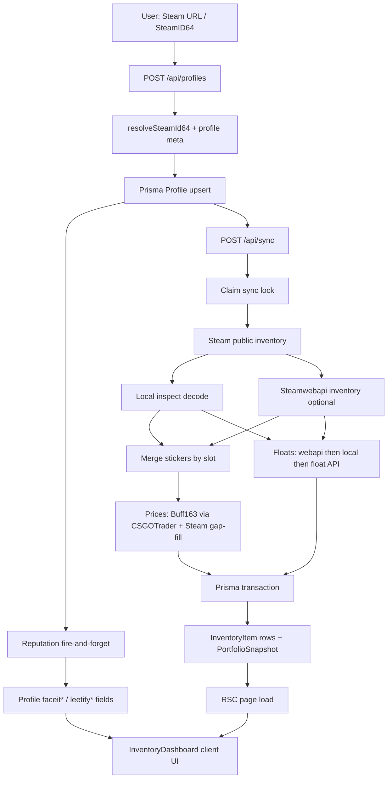

# Architecture

Local-first **SkinStation**: paste a public Steam profile, sync inventory + enrichment, store everything in **PostgreSQL** (Supabase for hosted / Vercel), and render portfolio UI in Next.js.

## Stack at a glance

| Layer | Choice |
| --- | --- |
| App | Next.js 15 App Router, React 19, TypeScript |
| UI | Tailwind CSS 4, Recharts, `html-to-image` |
| Fonts | Fraunces (display), Outfit (body) via `next/font` |
| DB | Prisma 6 + PostgreSQL (Supabase) |
| Inspect decode | `@vlydev/cs2-masked-inspect` (+ `@csfloat/cs2-inspect-serializer` fallback) |

Prisma is imported **only** from `@/lib/db` (singleton). Never instantiate `PrismaClient` elsewhere.

---

## Directory structure

```
InventoryTracker/
├── .cursor/rules/          # Agent coding rules
├── prisma/
│   ├── schema.prisma       # Profile, InventoryItem, PriceCache, snapshots
│   └── migrations/
├── public/
│   └── faceit/             # FACEIT level icons (/faceit/level-1.png … 10)
├── scripts/                # One-off probes / dumps (Node .mjs)
├── src/
│   ├── app/                # Routes (RSC pages + API handlers)
│   ├── components/         # Client UI ("use client")
│   └── lib/                # Server/shared domain logic
├── .env.example
└── package.json
```

### `src/app` — routes

| Path | File | Role |
| --- | --- | --- |
| `/` | `app/page.tsx` | Home: recent profiles + `ProfileLookup` |
| `/inventory/[id]` | `app/inventory/[id]/page.tsx` | Inventory dashboard (loads Prisma → client UI) |
| `/share/[id]` | `app/share/[id]/page.tsx` | Share / Wrapped card (`?source=buff\|steam`) |
| `POST/GET /api/profiles` | `app/api/profiles/route.ts` | Create / list profiles |
| `GET /api/profiles/[id]` | `app/api/profiles/[id]/route.ts` | Profile + items JSON |
| `POST /api/sync` | `app/api/sync/route.ts` | Run inventory sync (`maxDuration` 300s) |
| `GET /api/image-proxy` | `app/api/image-proxy/route.ts` | CORS-safe images for PNG export |

Next.js 15: `params` / `searchParams` are **Promises** — always `await` them.

### `src/lib` — domain modules

| Module | Responsibility |
| --- | --- |
| `lib/db.ts` | Prisma singleton |
| `lib/sync/inventory-sync.ts` | Profile upsert + full sync orchestrator |
| `lib/steam/resolve.ts` | SteamID64 / vanity / URL → profile meta |
| `lib/steam/inventory.ts` | Public Steam CS2 inventory fetch |
| `lib/steam/steam-proxy.ts` | Optional CF Worker proxy for Steam Community HTTP |
| `lib/csfloat/inspect.ts` | Local inspect-link float / sticker decode (masked + hybrid) |
| `lib/steamwebapi/*` | Optional inventory + float enrichment |
| `lib/stickers/*` | Parse, merge by slot, normalize names, icon catalog |
| `lib/steam-market/*` | CSGOTrader Buff163 + Steam prices + Market gap-fill |
| `lib/reputation/lookup.ts` | FACEIT + Leetify |
| `lib/currency.ts` / `lib/price-source.ts` | Currency / price-source prefs + totals |
| `lib/share-card*.ts` | Share card stats + PNG export helpers |

### `src/components` — client UI

All interactive UI lives here (`"use client"`): `ProfileLookup`, `InventoryDashboard`, toggles, reputation badges, hover cards, share dialog/card, charts.

---

## End-to-end data flow



### 1. Profile creation

1. Home form → `POST /api/profiles` with `{ input }`.
2. `ensureProfileFromInput()` (`lib/sync/inventory-sync.ts`):
   - Resolve SteamID64 (`lib/steam/resolve.ts`).
   - Fetch persona/avatar (`fetchSteamProfileMeta`).
   - `prisma.profile.upsert`.
   - Kick off `applyReputationToProfile` **without blocking**.
3. Client then calls `POST /api/sync`.

### 2. Inventory sync (`syncInventory`)

1. **Lock:** atomic `updateMany` where `syncing: false`. Force or stale lock (>10 min) can clear a stuck flag. Concurrent claim → error / HTTP 409.
2. **Inventory:** `fetchSteamInventory(steamId)` from Steam Community JSON (via optional `STEAM_PROXY_*` Cloudflare Worker when configured; otherwise direct from the app host).
3. **Floats / patterns:**
   - Local decode of masked/hybrid inspect links (`lib/csfloat/inspect.ts`).
   - Optional self-hosted inspect API (`INSPECT_API_URL`, CSGOFloat-compatible).
   - Optional Steamwebapi inventory + per-asset float (last-resort when `STEAMWEBAPI_KEY` is set).
4. **Stickers:** `mergeStickersBySlot(descriptions, local, inspect API, certificate, webapi)` → icons + prices looked up by normalized `Sticker | Name`.
5. **Prices (write path):**
   1. CSGOTrader Buff163 dump → `buffPrice`
   2. CSGOTrader bulk Steam dump → `steamPrice`
   3. Steam Market `priceoverview` → limited gap-fill
6. **Persist** in one transaction:
   - Replace `InventoryItem` rows for the profile
   - Create `PortfolioSnapshot`
   - Set `lastSyncedAt`, `syncing: false`, optional soft `lastError` (float-provider warning)

**Float precedence per item:** local inspect (masked/hybrid) → `INSPECT_API_URL` → Steamwebapi → previous DB value.

**Stickers in DB:** `InventoryItem.stickers` is a **JSON string**. Always parse with `parseStickersJson()` at read boundaries (pages / API).

### 3. Reputation (FACEIT / Leetify)

| Source | Auth | Role |
| --- | --- | --- |
| Leetify public API | None | Rating + FACEIT rank fallback |
| FACEIT Open API | Optional `FACEIT_API_KEY` | Official level / ELO / nickname |
| FaceitFinder | Link only | Profile URL when official URL unavailable |

Triggered on profile create, during sync (parallel), and on inventory page load if never fetched. Cached ~24h unless forced. Failures never block inventory sync.

---

## Frontend render path

```
PostgreSQL / Supabase (Prisma)
    ↓
RSC page (inventory/[id]/page.tsx)
  - load Profile + items + snapshots
  - parse stickers JSON
  - optional non-blocking reputation backfill
    ↓
InventoryDashboard (client)
  - filters / sort / search
  - currency + price-source toggles
  - Refresh / Force → POST /api/sync → router.refresh()
  - ItemHoverCard, ReputationBadges, Recharts, ShareCardDialog
```

Share flow: `ShareCardDialog` / `/share/[id]` builds card stats (`lib/share-card.ts`), proxies images when needed (`/api/image-proxy`), exports PNG via `html-to-image` in a click handler only.

---

## Where state is managed

### Server (source of truth)

| Store | Contents |
| --- | --- |
| `Profile` | Steam identity, `currency`, reputation fields, `syncing`, `lastSyncedAt`, `lastError` |
| `InventoryItem` | Skin rows, float/seed, prices, stickers JSON |
| `PriceCache` | Cached Buff163/Steam prices by name + currency |
| `PortfolioSnapshot` | Historical portfolio totals per sync |
| `CatalogMeta` | Price catalog fetch bookkeeping |

### Client (ephemeral / preference)

| Location | State |
| --- | --- |
| `ProfileLookup` | Input, loading, errors; kicks create + sync |
| `InventoryDashboard` | Query, filters, sort, syncing UI, share dialog open |
| `CurrencyToggle` | Writes `Profile.currency` via sync; also localStorage |
| `PriceSourceToggle` | Client-only preference (which market to **display**) |

**localStorage keys:**

| Key | Values |
| --- | --- |
| `inventory-tracker-currency` | `USD` \| `EUR` |
| `inventory-tracker-price-source` | `buff` \| `steam` (legacy `skinport` maps to `buff`) |

Hydration rule: initialize with stable defaults, then read localStorage in `useEffect` (never in `useState` initializers).

### Display vs stored prices

- **Stored:** separate `steamPrice` and `buffPrice` columns.
- **Displayed:** `itemPrice()` / `portfolioTotalFromItems()` apply fallback  
  (`buff ?? steam` or `steam ?? buff` depending on toggle).  
  Grid totals and the portfolio stat must use the same helper.

---

## External services

| Service | Purpose |
| --- | --- |
| Steam Community | Vanity resolve, profile XML, public inventory (optionally via CF Worker) |
| Cloudflare Worker (`workers/steam-proxy`) | Optional authenticated Steam fetch proxy off Vercel egress |
| Steam Market | `priceoverview` gap-fill |
| CSGOTrader price dump | Buff163 + Steam prices |
| Frankfurter | USD→EUR for CSGOTrader when needed |
| Steamwebapi.com | Optional last-resort floats (`STEAMWEBAPI_KEY`) |
| Self-hosted inspect API | Preferred remote floats via `INSPECT_API_URL` |
| FACEIT Data API | Optional ranks (`FACEIT_API_KEY`) |
| Leetify public API | Rating + FACEIT fallback |
| ByMykel CSGO-API | Sticker icon catalog |

Optional keys degrade gracefully: skip enrichers, show soft warnings, keep core Steam sync working.

---

## Important invariants

1. **Prisma only via `@/lib/db`.**
2. **Sync lock is atomic**; Force / stale timeout can clear stuck `syncing`.
3. **Cooldown** via `SYNC_COOLDOWN_MS` (see `.env.example`); Force and currency change bypass it.
4. **Reputation never blocks** create/sync.
5. **Missing prices never throw**; UI shows `—` / empty.
6. **No nested `<a>` / `Link`** (reputation chips stay siblings of nav links).
7. **Steamwebapi quota:** soft warning on profile / hover; do not keep burning float calls after a limit response.

---

## Environment

| Variable | Required | Notes |
| --- | --- | --- |
| `DATABASE_URL` | Yes | Supabase **pooled** Postgres URL (runtime, often port 6543 + `pgbouncer=true`) |
| `DIRECT_URL` | Yes | Supabase **direct** Postgres URL (migrations, port 5432) |
| `UPSTASH_REDIS_REST_URL` | No | Distributed rate limits on Vercel (with token) |
| `UPSTASH_REDIS_REST_TOKEN` | No | Pair with Upstash URL |
| `SYNC_FORCE_SECRET` | No | Admin force-sync via `x-sync-force-secret` header |
| `SYNC_COOLDOWN_MS` | No | Refresh cooldown |
| `INSPECT_API_URL` | No | Preferred self-hosted inspect/float API (omit on Vercel v1 → degrade floats) |
| `STEAMWEBAPI_KEY` | No | Optional last-resort floats (omit on Vercel v1) |
| `FACEIT_API_KEY` | No | Official FACEIT ranks |
| `STEAM_PROXY_URL` | No | Cloudflare Worker base URL — recommended on Vercel |
| `STEAM_PROXY_SECRET` | No | Bearer secret shared with the Worker (never `NEXT_PUBLIC_`) |

See `.env.example`, `README.md`, and `docs/DEPLOY.md` for setup. Vercel build should use `npm run build:vercel` (`prisma migrate deploy && next build`).
