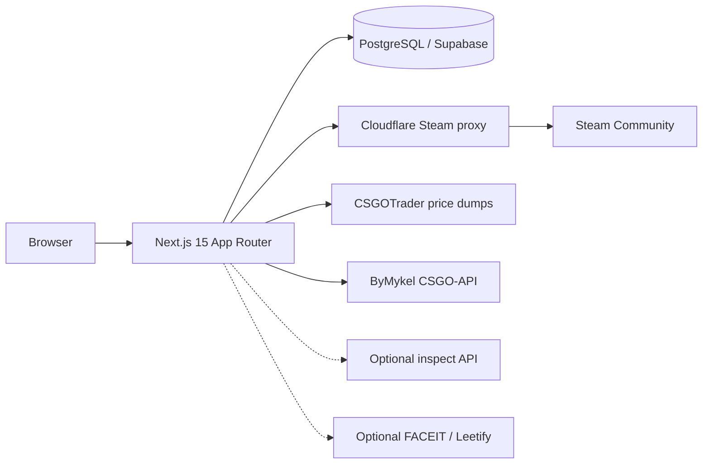

# SkinStation

**Your one-stop for CS2 inventory tracking, the skin catalog, and trade-up odds.**

SkinStation is a public-inventory CS2 tracker: paste a Steam profile, sync the CS2 backpack, price it against Buff163 and the Steam Market, browse the live skin catalog, and compute trade-up expected value. There is **no Steam login** and **no user accounts**. Only inventories set to **Public** on Steam can be loaded.

Data is stored in **PostgreSQL** (Supabase for hosted / Vercel). The Next.js app talks to Postgres through Prisma — not through the Supabase JS client.

Not affiliated with Valve or Steam. CS2 trademarks and assets belong to Valve Corporation.

> Internals, diagrams, and design rationale: **[`ARCHITECTURE.md`](ARCHITECTURE.md)**  
> Production deploy checklist: **[`docs/DEPLOY.md`](docs/DEPLOY.md)**  
> Steam Community fetch proxy: **[`workers/steam-proxy/README.md`](workers/steam-proxy/README.md)**

---

## Table of contents

- [What you get](#what-you-get)
- [How it works](#how-it-works)
- [Tech stack](#tech-stack)
- [Prerequisites](#prerequisites)
- [Local setup](#local-setup)
- [Environment variables](#environment-variables)
- [Scripts](#scripts)
- [Usage](#usage)
- [Deployment](#deployment)
- [Floats without Steamwebapi](#floats-without-steamwebapi)
- [Known limitations](#known-limitations)
- [Security model](#security-model)
- [Project layout](#project-layout)
- [License & disclaimer](#license--disclaimer)

---

## What you get

### Inventory (`/inventory`, `/inventory/[id]`)

- Look up a public Steam profile from the home page or `/inventory` (SteamID64, vanity URL, or Community profile URL).
- Buff163 prices (via [CSGOTrader](https://prices.csgotrader.app)) plus Steam Market `priceoverview` gap-fill.
- Display toggle: **Buff163** vs **Steam Market**, with **USD / EUR**.
- Search, filters (StatTrak, Souvenir, knives/gloves, stickers), sort, grid/list views.
- Portfolio total and sync-snapshot chart (7D / 30D / 90D / 1Y / All).
- Optional FACEIT level and Leetify rating badges.
- CSV / JSON export.
- **SkinStation Wrapped** share cards at `/share/[id]` (theme + price source; PNG export via `html-to-image`).

### Skin Database (`/database`, `/database/[id]`, `/collections/[id]`)

- Browse the live CS2 item catalog (skins, cases, stickers, agents, and more) from [ByMykel/CSGO-API](https://github.com/ByMykel/CSGO-API).
- Item detail pages with wear bands, Doppler phases, and Buff/Steam market links.
- Collection pages at `/collections/[id]`.

### Trade-up Calculator (`/tradeup`)

- Build contracts from a linked inventory or a sandbox picker.
- Outcome odds, predicted floats, expected value, profit, and ROI.
- Standard **10-slot** weapon contracts and **5-slot Covert → knife/glove** contracts.
- StatTrak contracts are supported; Souvenir items are not valid inputs.

---

## How it works

SkinStation never asks for Steam credentials. A lookup resolves a public profile, claims a per-profile sync lock, fetches CS2 inventory JSON (app `730`, context `2`), enriches floats/stickers/prices, and persists a snapshot.



On Vercel, Steam Community calls should go through the authenticated Cloudflare Worker in `workers/steam-proxy` so they do not originate from shared Vercel egress IPs. When `STEAM_PROXY_URL` / `STEAM_PROXY_SECRET` are unset (typical local dev), the app calls Steam directly.

---

## Tech stack

| Layer | Choice | Why |
| --- | --- | --- |
| App | Next.js 15 (App Router) + React 19 + TypeScript | RSC pages for inventory/catalog; Route Handlers for sync; `params` / `searchParams` are Promises |
| UI | Tailwind CSS 4 (`@import "tailwindcss"` / `@theme`) | CSS-first theming; no legacy `tailwind.config.js` |
| Fonts | Inter (UI), JetBrains Mono (data), Fraunces + Outfit (share cards) | Loaded via `next/font` in `src/app/layout.tsx` |
| Charts / export | Recharts, `html-to-image` | Client-only (`'use client'`); PNG export only in click handlers |
| Database | Prisma 6 + PostgreSQL | Singleton at `@/lib/db`; `DATABASE_URL` (pooled) + `DIRECT_URL` (migrations) |
| Hosting DB | Supabase Postgres | Transaction pooler for runtime, direct connection for `prisma migrate` |
| Rate limits | Upstash Redis (`@upstash/ratelimit`) | Shared across Vercel instances; in-memory fallback per isolate |
| Inspect decode | `@vlydev/cs2-masked-inspect` + `@csfloat/cs2-inspect-serializer` | Local masked/hybrid inspect links without a GC bot |
| Analytics | `@vercel/analytics` | Privacy-friendly page views; no ad pixels |
| Steam egress | Cloudflare Worker (`workers/steam-proxy`) | Authenticated Bearer proxy; not a public CORS proxy |

**Not used at runtime (despite being in `package.json`):** `@supabase/ssr` and `@supabase/supabase-js`. All database access is Prisma. There is no Supabase Auth session.

---

## Prerequisites

- **Node.js 20+** (Next.js 15)
- **npm** (lockfile is `package-lock.json`)
- A **PostgreSQL** database (a [Supabase](https://supabase.com) project is the documented production path)
- Optional for production: [Upstash Redis](https://upstash.com), Cloudflare account (Wrangler) for the Steam proxy, self-hosted [CSGOFloat](https://github.com/Step7750/CSGOFloat)-compatible inspect service

---

## Local setup

1. Create a [Supabase](https://supabase.com) project (Postgres).
2. Copy `.env.example` → `.env` and set:
   - `DATABASE_URL` — **Transaction pooler** URI (port `6543`, typically with `?pgbouncer=true`)
   - `DIRECT_URL` — **Direct** URI (port `5432`) for migrations
3. Install, migrate, and run:

```bash
npm install
npm run db:deploy
npm run smoke:db
npm run dev
```

Open [http://localhost:3001](http://localhost:3001). The dev server binds **port 3001** (`next dev -p 3001`).

### First-time schema changes

Use `npm run db:migrate` (`prisma migrate dev`) when you edit `prisma/schema.prisma`. Use `npm run db:deploy` (`prisma migrate deploy`) against shared / production databases — never `db push` on hosted Postgres unless you intend to skip migration history.

### Harden the Supabase Data API (recommended)

Prisma uses the connection string as the database owner. The hosted Supabase Data API (`anon` / `authenticated` roles) should not be able to read these tables. After migrate:

```bash
npm run db:harden
```

Or paste [`scripts/supabase-harden.sql`](scripts/supabase-harden.sql) into the Supabase SQL Editor. This revokes table grants and `rls_auto_enable` execute from `anon` / `authenticated`.

---

## Environment variables

Canonical comments live in [`.env.example`](.env.example). **Never commit `.env`.** Do not prefix secrets with `NEXT_PUBLIC_`.

| Variable | Required | Default / fallback | Description |
| --- | --- | --- | --- |
| `DATABASE_URL` | **Yes** | — | Pooled Postgres URL used by the Next.js runtime (Supabase transaction pooler, port `6543`, often `?pgbouncer=true`) |
| `DIRECT_URL` | **Yes** | — | Direct Postgres URL for `prisma migrate` (port `5432`) |
| `NEXT_PUBLIC_SITE_URL` | No | `https://$VERCEL_URL` on Vercel; else `http://localhost:3001` | Canonical public origin (no trailing slash) for SEO, sitemap, Open Graph |
| `SYNC_COOLDOWN_MS` | No | `180000` in `.env.example`; **15 minutes** in code if unset | Minimum ms between successful refreshes per profile. Currency change and authorized force-sync bypass cooldown |
| `SYNC_FORCE_SECRET` | No | unset (force disabled) | Enables admin force-sync via `x-sync-force-secret` or `Authorization: Bearer …`. Public UI has no Force button |
| `UPSTASH_REDIS_REST_URL` | No | in-memory limiter | Recommended on Vercel for distributed rate limits |
| `UPSTASH_REDIS_REST_TOKEN` | No | — | Pair with the Upstash REST URL |
| `STEAM_PROXY_URL` | No | direct Steam HTTP | Cloudflare Worker base URL (no trailing slash). **Recommended on Vercel** |
| `STEAM_PROXY_SECRET` | No | — | Bearer secret shared with the Worker. Both URL and secret must be set or neither is used |
| `INSPECT_API_URL` | No | local decode only | Self-hosted CSGOFloat-compatible inspect API (`GET ?url={inspectLink}`). Needed for classic S/A/D links |
| `INSPECT_API_KEY` | No | — | Optional API key / Bearer for the inspect service |
| `INSPECT_API_MAX_FETCHES` | No | `120` | Max remote inspect calls per sync |
| `INSPECT_API_DELAY_MS` | No | `1100` | Delay between inspect calls |
| `STEAMWEBAPI_KEY` | No | unused | Last-resort float enricher ([steamwebapi.com](https://www.steamwebapi.com)). Omit on Vercel v1 |
| `FACEIT_API_KEY` | No | Leetify public fallback | Official FACEIT Open API ranks; without it, Leetify public data may still fill level/ELO |

`VERCEL_URL` is set automatically by Vercel and is used only when `NEXT_PUBLIC_SITE_URL` is unset.

### Typical environments

| Context | Set these |
| --- | --- |
| Local dev | `DATABASE_URL`, `DIRECT_URL`, `SYNC_COOLDOWN_MS` |
| Vercel production (v1) | Above + `NEXT_PUBLIC_SITE_URL`, `STEAM_PROXY_*`, `UPSTASH_REDIS_*`. Omit inspect / Steamwebapi keys (degraded floats) |
| Full float coverage | Add `INSPECT_API_URL` (self-hosted GC bot). Optionally `STEAMWEBAPI_KEY` as last resort |

---

## Scripts

| Script | Purpose |
| --- | --- |
| `npm run dev` | Next.js dev server on port **3001** |
| `npm run build` | Production build (does not run migrations) |
| `npm run build:vercel` | `prisma migrate deploy && next build` (also set in `vercel.json`) |
| `npm start` | `next start -p 3001` |
| `npm run lint` | `next lint` |
| `npm run db:generate` | `prisma generate` (also runs as `postinstall`) |
| `npm run db:migrate` | `prisma migrate dev` — local schema changes |
| `npm run db:deploy` | `prisma migrate deploy` — CI / Vercel / shared DBs |
| `npm run db:push` | `prisma db push` — avoid on production |
| `npm run smoke:db` | Connectivity + schema smoke check against configured Postgres |
| `npm run smoke:steam-proxy` | Unit checks for Steam proxy config / error mapping |
| `npm run db:harden` | Revoke Data API grants / `rls_auto_enable` EXECUTE (Supabase) |
| `npm run test:inspect-decode` | Probe local masked/hybrid float decode |

The Cloudflare Worker has its own package in `workers/steam-proxy` (`npm run deploy` → Wrangler).

---

## Usage

1. Set the CS2 inventory to **Public** on Steam (profile + game details + inventory).
2. Paste a Steam profile URL or SteamID64 on the home page or `/inventory`.
3. Wait for the first sync. Steam Market gap-fill is capped (~15 unique missing names per sync) so large inventories may need a second Refresh.
4. Use **Refresh** to re-scan. Cooldown is `SYNC_COOLDOWN_MS` (`.env.example` uses `180000` / 3 minutes; if unset, the app defaults to 15 minutes). There is no Force button in the public UI.
5. Use the nav for **Skin Database** and **Trade-up**.
6. Open `/share/[id]?source=buff|steam&theme=…` for a shareable Wrapped card.

### Admin force-sync

When `SYNC_FORCE_SECRET` is set:

```bash
curl -X POST https://YOUR_DOMAIN/api/sync \
  -H "Content-Type: application/json" \
  -H "x-sync-force-secret: YOUR_SYNC_FORCE_SECRET" \
  -d '{"profileId":"…","force":true}'
```

Force bypasses cooldown and per-profile rate limits. It does **not** steal a fresh in-progress lock (stale locks older than 10 minutes can be claimed).

---

## Deployment

Production target is **Vercel + Supabase**. Full checklist: [`docs/DEPLOY.md`](docs/DEPLOY.md).

Build command:

```bash
npm run build:vercel
```

That runs `prisma migrate deploy && next build`. `DIRECT_URL` must be available at build time.

Recommended production extras:

1. Deploy `workers/steam-proxy` and set `STEAM_PROXY_URL` + `STEAM_PROXY_SECRET` on Vercel (Production **and** Preview).
2. Create Upstash Redis and set `UPSTASH_REDIS_REST_URL` + `UPSTASH_REDIS_REST_TOKEN`.
3. Run `npm run db:harden` once against the production database.
4. Set `NEXT_PUBLIC_SITE_URL` to the canonical HTTPS origin.

Omit `INSPECT_API_*` and `STEAMWEBAPI_KEY` for v1 — floats degrade gracefully; inventory + prices still work.

---

## Floats without Steamwebapi

Steam’s public inventory JSON usually returns `%propid:N%` placeholders, which cannot be decoded locally. SkinStation uses this cascade (first finite value wins; previous DB floats are never wiped on a failed enrich):

1. **Local decode** of masked/hex and hybrid `S…A…D<hex>` inspect links (`@vlydev/cs2-masked-inspect`, with `@csfloat/cs2-inspect-serializer` fallback).
2. **`INSPECT_API_URL`** — CSGOFloat-compatible self-hosted inspect service (`GET ?url=…`).
3. **Optional `STEAMWEBAPI_KEY`** — last-resort inventory + per-asset float.
4. **Previous DB floats** preserved across syncs when enrichment fails.

Without remote float providers (typical Vercel v1 setup), many weapon floats stay empty. Stickers are still parsed from Steam description HTML when present.

Point `INSPECT_API_URL` at a self-hosted [CSGOFloat](https://github.com/Step7750/CSGOFloat)-style bot (or any compatible GC inspect service) when you want better float coverage. Public CSFloat/CSGOFloat cloud APIs are currently blocked by Valve rate limits.

---

## Known limitations

### Steam inventory fetches

Fresh syncs load public Steam Community inventory JSON (paginated, 2000 items/page, max ~40k). Steam rate-limits shared egress. On production, use the Cloudflare Worker proxy. Steam can still throttle Cloudflare’s shared ranges. When a prior successful sync exists, SkinStation **soft-fails** to the cached inventory instead of erroring hard.

### Steam Market prices

Steam rate-limits `priceoverview`. Sync fetches unique item names missing from the CSGOTrader catalog (max 15 gap-fill calls, ~1.1s delay, retries with backoff). If Steam throttles mid-sync, the next Refresh continues filling gaps from `PriceCache`. Missing prices show as `—` and never hard-fail the sync.

### Floats & stickers

Without `INSPECT_API_URL` (or optional Steamwebapi), only masked/hybrid inspect links get floats. Stickers are still parsed from Steam description HTML when present.

### Portfolio chart

The chart shows **your portfolio snapshots** from each successful sync (7D / 30D / 90D / 1Y / All). It does **not** backfill market history from before you started tracking.

### Public inventories only

Private or hidden CS2 inventories return HTTP 403 with a clear error. There is no Steam OpenID / OAuth path.

### Share URLs

`/inventory/[id]` and `/share/[id]` use opaque Prisma `cuid`s. Anyone with the link can view that cached snapshot. There is no per-user ACL.

Early Access status and roadmap copy also live on `/status`.

---

## Security model

SkinStation is a **public lookup cache**, not a multi-tenant SaaS with logins.

| Control | Behavior |
| --- | --- |
| User auth | None. No passwords, sessions, or Steam OAuth |
| API errors | Structured `{ error: string }` — internal messages are sanitized (`src/lib/api/errors.ts`) |
| Rate limits | Middleware: 10 POSTs/min/IP on `/api/sync` and `/api/profiles`; 60 GETs/min/IP on `/api/image-proxy`. Extra 6 syncs/hour per `profileId+IP` on `/api/sync` |
| Sync lock | Atomic `updateMany` claim with `syncLockToken`; stale after 10 minutes |
| Image proxy | HTTPS only; allowlisted Steam CDN hosts; 8 MB cap; blocks localhost / `.internal` |
| Steam proxy | Bearer secret; no `Access-Control-Allow-Origin: *`; CS2-only (`appid` 730) |
| Force sync | Header secret comparison; disabled when `SYNC_FORCE_SECRET` is unset |
| Profile list | `GET /api/profiles` returns rows only for caller-supplied ids (device localStorage) — not a global directory |
| Security headers | `X-Content-Type-Options`, `X-Frame-Options: DENY`, `Referrer-Policy`, `Permissions-Policy` via `src/middleware.ts` |

---

## Project layout

```
skinstation/
├── prisma/schema.prisma          # Profile, InventoryItem, PriceCache, snapshots
├── prisma/migrations/            # PostgreSQL migrations
├── src/app/                      # App Router pages + Route Handlers
├── src/components/               # Client UI ("use client")
├── src/lib/                      # Server/shared domain logic
├── workers/steam-proxy/          # Cloudflare Worker Steam fetch proxy
├── scripts/                      # Smoke tests, harden SQL, inspect probes
├── docs/DEPLOY.md
├── ARCHITECTURE.md
├── .env.example
└── vercel.json                   # buildCommand: npm run build:vercel
```

---

## License & disclaimer

This repository does not currently include an open-source license file (`private: true` in `package.json`). Treat it as proprietary unless the maintainers publish otherwise.

SkinStation is **not affiliated with Valve or Steam**. Counter-Strike 2, Steam, and related marks belong to Valve Corporation. Buff163, FACEIT, Leetify, and CSGOTrader are third-party services used as public data sources where documented.
